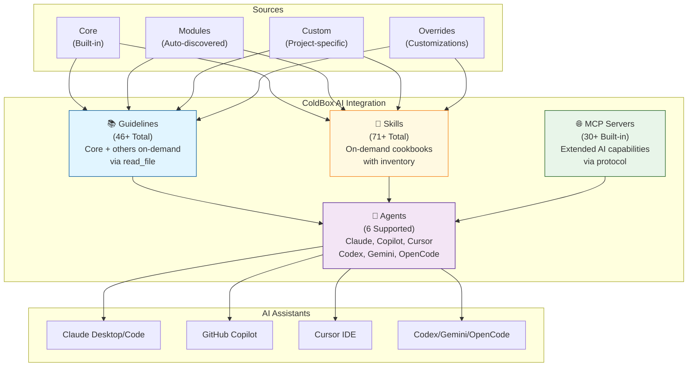
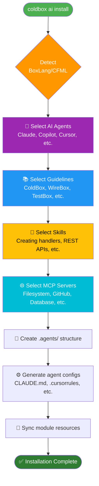
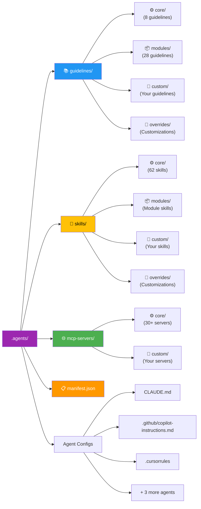
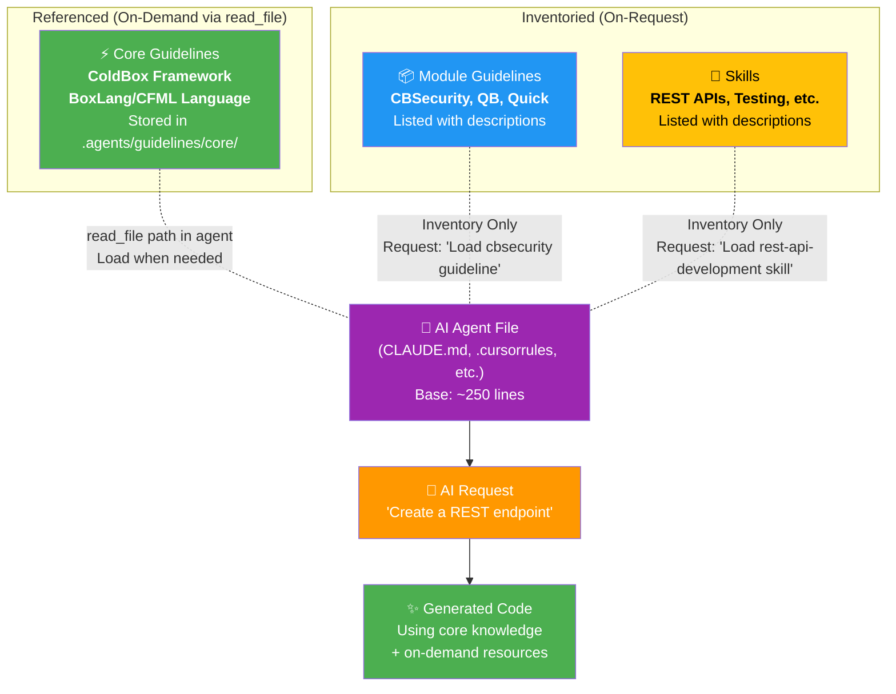
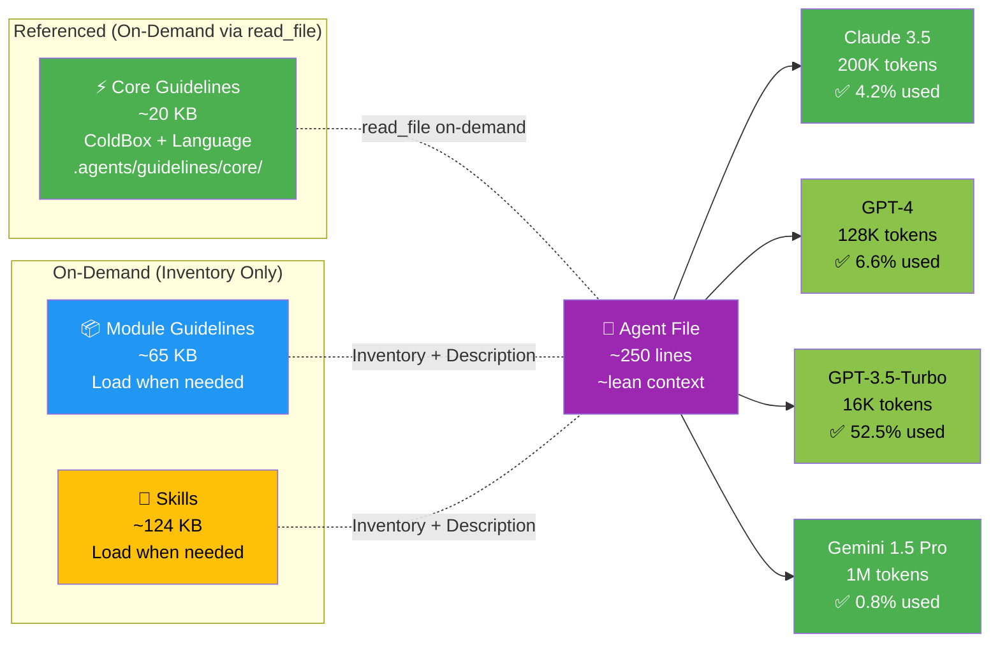
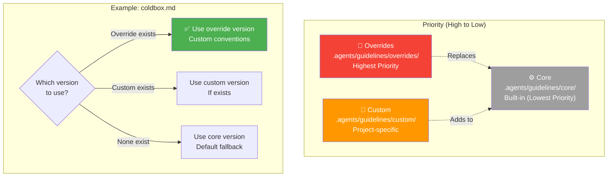
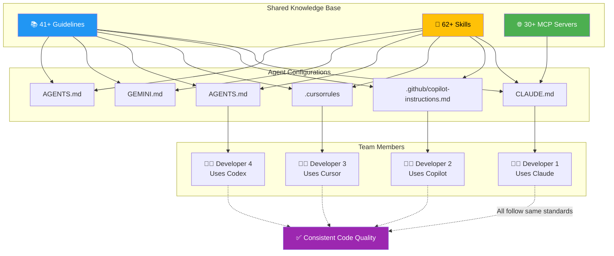
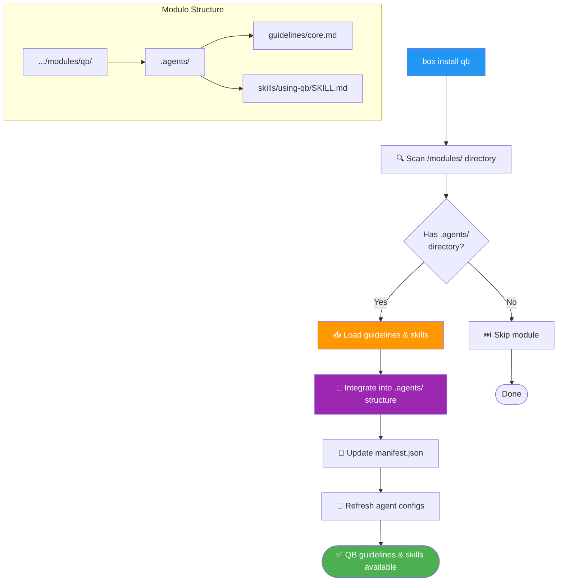

# Agentic ColdBox

## Table of Contents

* [Introduction](#introduction)
* [Installation](#installation)
* [Core Concepts](#core-concepts)
* [AI Guidelines](#ai-guidelines)
* [AI Skills](#ai-skills)
* [AI Agents](#ai-agents)
* [MCP Servers](#mcp-servers)
* [CLI Commands](#cli-commands)
* [Developer Experience](#developer-experience)
* [Module Integration](#module-integration)
* [Best Practices](#best-practices)

***

## Introduction

ColdBox AI Integration supercharges your development workflow by providing comprehensive AI assistance for both **BoxLang** and **CFML** applications. Unlike single-framework solutions, ColdBox AI Integration offers:

* **Dual-Language Support**: First-class support for BoxLang and CFML with automatic detection
* **Multi-Agent Ecosystem**: Works with Claude, GitHub Copilot, Cursor, Codex, Gemini, and OpenCode
* **30+ MCP Servers**: Extensive Model Context Protocol server registry for enhanced AI capabilities
* **Module Awareness**: Automatically integrates guidelines and skills from installed modules
* **Context Analytics**: Built-in tools to visualize and optimize AI context usage
* **Override System**: Flexible customization at core, module, and project levels
* **Health Diagnostics**: Intelligent validation and troubleshooting tools

The system combines four key components:

1. **Guidelines** - Framework documentation and best practices (core referenced on-demand, others also on-demand)
2. **Skills** - On-demand coding cookbooks for specific tasks
3. **Agents** - AI assistant configurations (Claude, Copilot, etc.)
4. **MCP Servers** - Context protocol servers for enhanced AI capabilities

**Subagent Pattern Architecture**: Core framework guidelines (ColdBox + language) are stored locally in `.agents/guidelines/core/` and referenced via `read_file` instructions in agent files. Module guidelines and all skills are also available on-demand via inventory. This keeps agent files to ~250 lines while maintaining full capability.

Together, these components ensure AI assistants generate high-quality, idiomatic code that follows ColdBox conventions and leverages the full power of the BoxLang/CFML ecosystem.


To start, make sure you are on the latest `coldbox-cli` in your CommandBox installation.


### System Architecture



***

## Installation

### Quick Start

Install ColdBox AI Integration using CommandBox:

```bash
# Install ColdBox CLI (if not already installed)
box install coldbox-cli

# Set up AI integration with an interactive wizard
coldbox ai install
```

The installation wizard will guide you through:

1. **Agent Selection** - Choose which AI assistants you use (Claude, Copilot, Cursor, etc.)
2. **Guidelines** - Select framework documentation to include
3. **Skills** - Choose coding cookbooks for your workflow
4. **MCP Servers** - Configure Model Context Protocol servers




After installation, the following structure is created in your project:

```
.agents/
├── guidelines/          # AI guidelines (documentation)
│   ├── core/           # ColdBox core guidelines
│   ├── modules/        # From installed modules
│   ├── custom/         # Your project-specific guidelines
│   └── overrides/      # Custom versions of core/module guidelines
├── skills/             # AI skills (cookbooks)
│   ├── core/           # Built-in skills
│   ├── modules/        # From installed modules
│   ├── custom/         # Your custom skills
│   └── overrides/      # Custom versions of core/module skills
├── mcp-servers/        # MCP server configurations
└── manifest.json       # AI integration metadata
```





Additionally, agent configuration files are created for you (paths defined in `AgentRegistry.cfc`):

* `CLAUDE.md` - Claude Desktop/Code assistant (points to `AGENTS.md` via `@AGENTS.md`)
* `.github/copilot-instructions.md` - GitHub Copilot
* `.cursorrules` - Cursor IDE
* `AGENTS.md` - Codex, OpenCode & Claude (shared file)
* `GEMINI.md` - Gemini CLI

### Keeping Resources Updated

Keep your AI resources synchronized with installed modules:

```bash
# Update guidelines and skills
coldbox ai refresh

# Run this after installing/updating modules
box install qb
coldbox ai refresh
```

Automate updates by adding to your CommandBox scripts in `box.json`:

```json
{
  "scripts": {
    "postInstall": "coldbox ai refresh",
    "postUpdate": "coldbox ai refresh"
  }
}
```

### Setting Up AI Agents

After installation, configure your AI agents:

**Claude Desktop:**

1. Open Claude Desktop settings
2. Enable the MCP server for your project
3. Restart Claude Desktop

**GitHub Copilot (VS Code):**

1. Agent configuration is automatically in `.github/copilot-instructions.md`
2. Reload VS Code window
3. Copilot will use the instructions automatically

**Cursor:**

1. The `.cursorrules` file is automatically recognized
2. Restart Cursor IDE
3. Rules are applied to all AI interactions

**Other Agents:**

* Follow the specific agent's documentation for loading instruction files
* Configuration files are generated during `coldbox ai install`

***

## Core Concepts

### Guidelines vs Skills

ColdBox AI Integration uses a **subagent pattern** with three tiers of context:

| Aspect          | Core Guidelines (Referenced)               | Module Guidelines (On-Demand)         | Skills (On-Demand)                    |
| --------------- | ------------------------------------------ | ------------------------------------- | ------------------------------------- |
| **When Loaded** | Requested via `read_file` when needed      | Requested by name when needed         | Requested by name when needed         |
| **Scope**       | Essential framework knowledge              | Module-specific documentation         | Focused, task-specific                |
| **Purpose**     | Core ColdBox + language conventions        | Extended module patterns              | Step-by-step implementation guides    |
| **Content**     | "What" and "Why" (fundamentals)           | "What" and "Why" (specialized)       | "How" and "When" (actionable)        |
| **Size**        | ~20KB (ColdBox + language)                 | 1-5KB per guideline                   | 2-10KB per skill                      |
| **Storage**     | `.agents/guidelines/core/` path in agent file  | Inventory with descriptions           | Inventory with descriptions           |
| **Examples**    | ColdBox MVC structure, BoxLang syntax      | CBSecurity patterns, QB query builder | Creating REST APIs, Writing tests     |

**Core Guidelines** (ColdBox framework + language) are stored in `.agents/guidelines/core/` and referenced in agent files. Agents load them on-demand using `read_file` when they need framework or language knowledge.

**Module Guidelines** are inventoried with descriptions, allowing agents to discover and request specific module documentation when needed.

**Skills** are activated on-demand when working on specific tasks. Both module guidelines and skills use the inventory pattern to reduce context bloat while providing deep expertise exactly when needed.




### Context Management

ColdBox AI Integration includes sophisticated context tracking:

* **Automatic Estimation**: Calculates total context size in KB and tokens
* **Usage Indicators**: Color-coded warnings (Low/Moderate/High/Very High)
* **Model Compatibility**: Shows utilization for Claude, GPT-4, GPT-3.5-Turbo, Gemini
* **Optimization Alerts**: Warns when context exceeds recommended thresholds

Use the stats command to monitor context usage:

```bash
coldbox ai stats                 # Quick overview
coldbox ai stats --verbose       # Detailed model breakdowns
coldbox ai stats --json          # Machine-readable output
```




**Context Optimization**: The subagent pattern keeps agent files to **~250 lines** (down from ~1,000 lines when guidelines were inlined) while maintaining full framework knowledge through on-demand `read_file` loading and the inventory system.

### Multi-Language Support

ColdBox AI Integration is **the only AI system with native BoxLang and CFML support**:

**Automatic Language Detection:**

* Server engine detection (BoxLang runtime)
* `box.json` configuration (`language` property)
* TestBox runner settings

**Language-Specific Content:**

* Separate templates for BoxLang and CFML
* Syntax-appropriate code examples
* Version-specific best practices

**Seamless Switching:**

* Override detection with `--boxlang` or `--cfml` flags
* Per-guideline language targeting
* Mixed-language project support

***

## AI Guidelines

Guidelines are instructional documents that teach AI agents about framework conventions, architectural patterns, and best practices. **Core framework guidelines (ColdBox + language) are stored in `.agents/guidelines/core/` and referenced in agent files via `read_file` paths**. Module and custom guidelines are available on-demand through an inventory system with descriptions.

### Available Guidelines

ColdBox AI Integration includes **46+ built-in guidelines** covering the entire ecosystem:

**Core Framework (5 - Referenced via `read_file`)**

* **boxlang** - BoxLang language features and syntax
* **cfml** - CFML language fundamentals
* **coldbox** - ColdBox framework architecture and conventions
* **testbox** - BDD/TDD testing framework
* **docbox** - Documentation generation

**Module Guidelines (41+ - Available On-Demand)**

*Authentication & Security*
* **cbsecurity** - Enterprise security framework
* **cbauth** - Authentication system
* **cbcsrf** - CSRF protection
* **cbsecurity-passkeys** - Passwordless authentication

*Database & ORM*
* **qb** - Query Builder
* **quick** - Active Record ORM
* **cborm** - ORM integration
* **cbmigrations** / **commandbox-migrations** - Database migrations

*REST & APIs*
* **cbswagger** - API documentation
* **hyper** - HTTP client
* **cbvalidation** - Data validation
* **cors** - CORS configuration

*Caching & Performance*
* **cachebox** - Caching strategies (when not using core)
* **cbstorages** - Storage abstractions

*Development Tools*
* **cbdebugger** - Debugging tools
* **route-visualizer** - Route inspection
* **commandbox-cfformat** - Code formatting
* **commandbox-boxlang** - BoxLang runtime

*Additional Modules (20+)*
* And many more: cbstreams, cbmailservices, cbmessagebox, cbpaginator, cbwire, mementifier, etc.

View installed guidelines:

```bash
coldbox ai guidelines list              # Brief list
coldbox ai guidelines list --verbose    # With descriptions
```

### Guideline Types

Guidelines are organized into four tiers:

1. **Core** - Built into ColdBox CLI, framework-level documentation
2. **Module** - Automatically discovered from installed CommandBox modules
3. **Custom** - Your project-specific guidelines in `.agents/guidelines/custom/`
4. **Override** - Custom versions replacing core/module guidelines

This hierarchy allows seamless integration from framework to module to project level.




### Custom Guidelines

Add project-specific guidelines to tailor AI assistance to your codebase:

```bash
# Create a custom guideline
touch .agents/guidelines/custom/payment-processing.md
```


Example guideline structure:


```markdown
# Payment Processing

This application uses Stripe for payment processing with a custom abstraction layer.

## Architecture

- `models/payments/` - Payment domain models
- `services/PaymentService.cfc` - Main payment service
- `config/stripe.cfc` - Stripe configuration

## Creating Charges

Always use the PaymentService singleton:

\`\`\`javascript
property name="paymentService" inject="PaymentService";

function chargeCustomer( required amount, required customerID ){
    return paymentService.createCharge({
        amount: arguments.amount,
        customer: arguments.customerID,
        currency: "usd"
    });
}
\`\`\`

## Important Conventions

1. Always validate amounts before charging
2. Log all payment attempts to `payment-audit` logger
3. Use idempotency keys for charge retries
4. Handle webhook events in `handlers/webhooks/Stripe.cfc`
```

Custom guidelines will be automatically included in agent configurations.

### Overriding Guidelines

Override core or module guidelines to customize them for your needs:

```bash
# Override a core guideline
coldbox ai guidelines override coldbox

# Edit the override
edit .agents/guidelines/overrides/coldbox.md
```

Overrides take precedence over core/module guidelines, allowing you to adapt standard documentation to your team's conventions.

### Module Guidelines

CommandBox module authors can include AI guidelines in their packages:

**Directory Structure:**

```
your-module/
├── ModuleConfig.cfc
└── .agents/
    └── guidelines/
        └── core.md           # Auto-discovered
```

**Module Guideline Template:**

```markdown
# Module Name

Brief description of what your module does.

## Installation

\`\`\`bash
box install your-module
\`\`\`

## Key Concepts

- Concept 1: Brief explanation
- Concept 2: Brief explanation

## Common Usage

\`\`\`javascript
// Example code
moduleService.doSomething();
\`\`\`

## Best Practices

1. Always do X before Y
2. Use setting `foo` for production
3. Call `z()` in your Application.cfc
```

Keep module guidelines concise (1-3KB). Users can override them if needed.

***

## AI Skills

Skills are on-demand coding cookbooks that provide detailed, step-by-step guidance for specific development tasks. Like module guidelines, skills use an inventory system with descriptions, allowing AI agents to discover and request them when needed. This keeps AI context lean while providing deep expertise exactly when required.

### Available Skills

ColdBox AI Integration includes **71+ built-in skills** (all available on-demand through the inventory system):

**Scaffolding & Creation (12)**

* **creating-applications** - New app generation
* **creating-handlers** - Controller creation
* **creating-models** - Model and service creation
* **creating-views** - View templates
* **creating-layouts** - Layout templates
* **creating-resources** - RESTful resources
* **creating-interceptors** - AOP interceptors
* **creating-modules** - Module scaffolding
* **generating-crud** - Complete CRUD generation
* **generating-migrations** - Database migrations
* **generating-tests** - Test case creation
* **scaffolding-commands** - CLI command creation

**Testing & Quality (8)**

* **writing-unit-tests** - Unit testing patterns
* **writing-integration-tests** - Integration test strategies
* **writing-bdd-specs** - BDD specification style
* **using-mocks** - Test doubles and mocking
* **testing-handlers** - Controller testing
* **testing-models** - Model testing
* **testing-interceptors** - Interceptor testing
* **test-driven-development** - TDD workflow

**Configuration & Setup (6)**

* **configuring-environments** - Environment management
* **configuring-datasources** - Database configuration
* **configuring-routes** - Routing setup
* **configuring-wirebox** - DI configuration
* **configuring-caching** - Cache configuration
* **configuring-logging** - Logger setup

**Database & ORM (10)**

* **using-qb** - Query Builder patterns
* **using-cborm** - ORM usage
* **using-quick** - Quick ORM
* **creating-migrations** - Migration authoring
* **database-seeding** - Test data seeding
* **query-optimization** - SQL optimization
* **using-transactions** - Transaction management
* **database-relationships** - Entity relationships
* **using-scopes** - Query scopes
* **database-testing** - Database test strategies

**REST APIs (8)**

* **building-rest-apis** - RESTful API design
* **api-authentication** - API auth strategies
* **api-versioning** - version management
* **api-documentation** - OpenAPI/Swagger
* **api-error-handling** - Error responses
* **api-testing** - API testing
* **jwt-authentication** - JWT implementation
* **oauth-integration** - OAuth flows

**Security (6)**

* **implementing-authentication** - Auth systems
* **implementing-authorization** - Permission systems
* **using-cbsecurity** - CBSecurity module
* **securing-endpoints** - Endpoint protection
* **csrf-protection** - CSRF mitigation
* **input-validation** - Request validation

**Performance & Optimization (6)**

* **caching-strategies** - Cache patterns
* **async-programming** - Async execution
* **background-jobs** - Job queues
* **performance-monitoring** - Performance tracking
* **query-optimization** - Database optimization
* **memory-management** - Memory optimization

**Web Development (6+)**

* **handling-forms** - Form processing
* **file-uploads** - Upload handling
* **sending-email** - Email delivery
* **working-with-sessions** - Session management
* **flash-messaging** - Flash message patterns
* **asset-management** - Frontend assets

View installed skills:

```bash
coldbox ai skills list              # Brief list
coldbox ai skills list --verbose    # With descriptions
```

### Custom Skills

Create custom skills for your domain-specific workflows:

```bash
# Create a custom skill directory
mkdir -p .agents/skills/custom/deploying-to-kubernetes
touch .agents/skills/custom/deploying-to-kubernetes/SKILL.md
```

Example skill structure following [Agent Skills format](https://agentskills.io):

```markdown
---
name: deploying-to-kubernetes
description: Deploy ColdBox applications to Kubernetes with Helm
version: 1.0.0
---

# Deploying to Kubernetes

## When to use this skill

Use this skill when deploying ColdBox applications to Kubernetes clusters using our custom Helm charts.

## Prerequisites

- Helm 3.x installed
- kubectl configured
- Docker image built and pushed

## Deployment Steps

## 1. Configure Helm Values

Edit `kubernetes/values.yaml`:

\`\`\`yaml
app:
  name: my-coldbox-app
  image: registry.example.com/my-app:latest
  replicas: 3

database:
  host: postgres.default.svc.cluster.local
  name: myapp_production
\`\`\`

## 2. Deploy Application

\`\`\`bash
helm upgrade --install my-app ./kubernetes/chart \
  -f kubernetes/values.yaml \
  --namespace production
\`\`\`

## 3. Verify Deployment

\`\`\`bash
kubectl get pods -n production
kubectl logs -f deployment/my-app -n production
\`\`\`

## Rollback Procedure

If deployment fails:

\`\`\`bash
helm rollback my-app -n production
\`\`\`

## Troubleshooting

- **Pods not starting**: Check image pull secrets
- **Database connection failed**: Verify service DNS
- **Health check failing**: Review `/healthcheck` endpoint
```

Skills support additional files:

```
.agents/skills/custom/deploying-to-kubernetes/
├── SKILL.md              # Main skill content (required)
├── templates/            # Code templates
│   └── helm-values.yaml
├── scripts/              # Helper scripts
│   └── deploy.sh
└── docs/                 # Additional documentation
    └── architecture.md
```

### Overriding Skills

Override built-in skills to adapt them to your conventions:

```bash
# Override a core skill
coldbox ai skills override creating-handlers

# Edit the override
edit .agents/skills/overrides/creating-handlers/SKILL.md
```

### Module Skills

Module authors can bundle skills with their packages:

**Directory Structure:**

```
your-module/
├── ModuleConfig.cfc
└── .agents/
    └── skills/
        └── using-your-module/
            └── SKILL.md
```

**Module Skill Template:**

```markdown
---
name: using-your-module
description: Integrate and use YourModule features in ColdBox applications
version: 1.0.0
---

# Using YourModule

## When to use this skill

Use this skill when integrating YourModule for [specific functionality].

## Installation

\`\`\`bash
box install your-module
\`\`\`

## Configuration

Add to `config/ColdBox.cfc`:

\`\`\`javascript
moduleSettings = {
    "your-module" = {
        apiKey = getSystemSetting("YOURMODULE_KEY"),
        timeout = 30
    }
};
\`\`\`

## Basic Usage

\`\`\`javascript
property name="yourService" inject="YourService@your-module";

function doSomething( event, rc, prc ){
    var result = yourService.process( rc.data );
    event.renderData( data = result );
}
\`\`\`

## Common Patterns

## Pattern 1: Async Processing
[Details...]

## Pattern 2: Error Handling
[Details...]

## Best Practices

1. Always set timeout values
2. Cache API responses when possible
3. Use event listeners for notifications
```

***

## AI Agents

ColdBox AI Integration supports **6 major AI agents** with automatic configuration generation.

### Supported Agents

> **Note**: Agent configuration paths are centrally managed in `models/AgentRegistry.cfc`

| Agent              | Config File                       | Description                    |
| ------------------ | --------------------------------- | ------------------------------ |
| **Claude**         | `CLAUDE.md` → `AGENTS.md`         | Claude Desktop and Claude Code |
| **GitHub Copilot** | `.github/copilot-instructions.md` | VS Code Copilot integration    |
| **Cursor**         | `.cursorrules`                    | Cursor IDE rules               |
| **Codex**          | `AGENTS.md` (shared)              | Codex AI assistant             |
| **Gemini**         | `GEMINI.md`                       | Gemini CLI integration         |
| **OpenCode**       | `AGENTS.md` (shared)              | OpenCode assistant             |

### Agent Configuration

Manage agent configurations:

```bash
# List available agents
coldbox ai agents list

# Add agents
coldbox ai agents add claude copilot cursor

# Remove agents
coldbox ai agents remove cursor

# Regenerate all configurations
coldbox ai refresh
```

Each agent configuration includes:

* All active guidelines (core, module, custom, overrides)
* Available skills (with invocation instructions)
* MCP server configurations (where supported)
* Language-specific context (BoxLang/CFML)
* Project metadata and conventions

### Multi-Agent Development

ColdBox AI Integration supports multiple agents simultaneously:

```bash
# Set up for team with varied preferences
coldbox ai agents add claude copilot cursor codex

# Each developer uses their preferred agent
# All agents receive the same guidelines and skills
```

Benefits:

* **Team Flexibility**: Developers choose their preferred tools
* **Consistent Standards**: All agents follow same guidelines
* **Cross-Agent Testing**: Verify AI-generated code across multiple assistants
* **Redundancy**: Switch agents if one has issues




***

## MCP Servers

Model Context Protocol (MCP) servers provide extended capabilities to AI agents. ColdBox AI Integration includes the **largest collection of MCP servers** in any framework tooling.

### Built-in MCP Servers

**30+ Core MCP Servers** organized by category:

**Development Tools (10)**

* **@modelcontextprotocol/server-filesystem** - File system operations
* **@modelcontextprotocol/server-github** - GitHub integration
* **@modelcontextprotocol/server-gitlab** - GitLab integration
* **@modelcontextprotocol/server-git** - Git operations
* **@modelcontextprotocol/server-brave-search** - Web search
* **@modelcontextprotocol/server-fetch** - HTTP requests
* **@modelcontextprotocol/server-memory** - Persistent memory
* **@modelcontextprotocol/server-sequential-thinking** - Reasoning chains
* **@modelcontextprotocol/server-everart** - Image generation
* **@modelcontextprotocol/server-slack** - Slack integration

**Database (5)**

* **@modelcontextprotocol/server-postgres** - PostgreSQL
* **@modelcontextprotocol/server-mysql** - MySQL/MariaDB
* **@modelcontextprotocol/server-sqlite** - SQLite
* **@modelcontextprotocol/server-mssql** - SQL Server
* **@modelcontextprotocol/server-mongodb** - MongoDB

**Cloud & Infrastructure (7)**

* **@modelcontextprotocol/server-aws-kb-retrieval-server** - AWS Knowledge Bases
* **@modelcontextprotocol/server-cloudflare-ai** - Cloudflare AI
* **@modelcontextprotocol/server-google-drive** - Google Drive
* **@modelcontextprotocol/server-google-maps** - Google Maps API
* **@modelcontextprotocol/server-gdrive** - Advanced Drive integration
* **@modelcontextprotocol/server-kubernetes** - K8s cluster management
* **@modelcontextprotocol/server-docker** - Docker operations

**Productivity (8)**

* **@modelcontextprotocol/server-puppeteer** - Browser automation
* **@modelcontextprotocol/server-playwright** - Browser testing
* **@modelcontextprotocol/server-sentry** - Error tracking
* **@modelcontextprotocol/server-linear** - Project management
* **@modelcontextprotocol/server-obsidian** - Note management
* **@modelcontextprotocol/server-raycast** - Raycast integration
* **@modelcontextprotocol/server-time** - Time operations
* **@modelcontextprotocol/server-youtube-transcript** - YouTube transcripts


View configured MCP servers:

```bash
coldbox ai mcp list         # List all servers
coldbox ai mcp info          # Show configuration details
```

### Custom MCP Servers

Add project-specific or third-party MCP servers:

```bash
# Add custom servers
coldbox ai mcp add @mycompany/internal-tools @vendor/custom-server

# Remove servers
coldbox ai mcp remove @vendor/custom-server
```

Custom server configuration in `.agents/manifest.json`:

```json
{
  "mcpServers": {
    "custom": [
      {
        "name": "@mycompany/internal-tools",
        "command": "npx",
        "args": ["-y", "@mycompany/internal-tools"],
        "description": "Company internal development tools"
      }
    ]
  }
}
```

### MCP Configuration

MCP server configurations are generated automatically as part of `coldbox ai install` and `coldbox ai refresh`.

Example generated `.mcp.json`:

```json
{
  "mcpServers": {
    "filesystem": {
      "command": "npx",
      "args": ["-y", "@modelcontextprotocol/server-filesystem", "/project/root"]
    },
    "github": {
      "command": "npx",
      "args": ["-y", "@modelcontextprotocol/server-github"],
      "env": {
        "GITHUB_PERSONAL_ACCESS_TOKEN": "ghp_..."
      }
    }
  }
}
```

***

## CLI Commands

ColdBox AI Integration provides comprehensive CLI commands for managing your AI integration.

### Setup & Management

```bash
# Initial setup
coldbox ai install                  # Interactive installation wizard
coldbox ai install agent claude  # Install for specific agent

# View configuration
coldbox ai info                     # Show current configuration
coldbox ai tree                     # Visual hierarchy of components
coldbox ai tree --verbose           # Include file paths

# Update resources
coldbox ai refresh                  # Sync with installed modules
```

### Component Management

**Guidelines:**

```bash
coldbox ai guidelines list                    # List installed
coldbox ai guidelines list --verbose          # With descriptions
coldbox ai guidelines add coldbox qb      # Install specific
coldbox ai guidelines remove qb            # Remove guideline
coldbox ai guidelines refresh                 # Update from modules
```

**Skills:**

```bash
coldbox ai skills list                        # List installed
coldbox ai skills list --verbose              # With descriptions
coldbox ai skills add creating-handlers       # Install specific
coldbox ai skills remove creating-handlers    # Remove skill
coldbox ai skills refresh                     # Update from modules
```

**Agents:**

```bash
coldbox ai agents list                        # List available
coldbox ai agents add claude copilot          # Add agents
coldbox ai agents remove cursor               # Remove agent
coldbox ai agents refresh                     # Regenerate configs
```

**MCP Servers:**

```bash
coldbox ai mcp list                           # List servers
coldbox ai mcp info                           # Show configuration
coldbox ai mcp add github postgres            # Add servers
coldbox ai mcp remove postgres                # Remove server
coldbox ai mcp config                         # Generate .mcp.json
```

### Diagnostics & Analytics

```bash
# Health diagnostics
coldbox ai doctor                   # Check integration health
coldbox ai doctor --fix             # Auto-fix common issues

# Context statistics
coldbox ai stats                    # Quick overview
coldbox ai stats --verbose          # Detailed breakdown
coldbox ai stats --json             # Machine-readable

# Visual structure
coldbox ai tree                     # Component hierarchy
coldbox ai tree --verbose           # With file paths
```

***

## Developer Experience

ColdBox AI Integration includes unique developer experience tools not found in other solutions.

### Visual Tree Structure

Visualize your AI integration structure:

```bash
coldbox ai tree
```

Output example:

```
AI Integration Structure for MyApp (1.0.0)

.agents/
├── guidelines/ (41)
│   ├── core/ (8)
│   │   ├── boxlang
│   │   ├── coldbox
│   │   ├── coldbox-routing
│   │   ├── wirebox
│   │   ├── logbox
│   │   ├── cachebox
│   │   ├── testbox
│   │   └── async
│   ├── modules/ (28)
│   │   ├── qb
│   │   ├── cborm
│   │   ├── cbsecurity
│   │   └── ...
│   └── custom/ (5)
│       ├── payment-processing
│       └── ...
├── skills/ (62)
│   ├── core/ (50)
│   └── custom/ (12)
├── agents/ (3)
│   ├── claude
│   ├── copilot
│   └── cursor
└── mcp-servers/ (30)
    ├── core/ (27)
    ├── module/ (2)
    └── custom/ (1)

┌─────────────────┬───────┐
│ Component       │ Count │
├─────────────────┼───────┤
│ Guidelines      │ 41    │
│ Skills          │ 62    │
│ Agents          │ 3     │
│ MCP Servers     │ 30    │
└─────────────────┴───────┘
```

### Context Usage Statistics

Analyze AI context consumption:

```bash
coldbox ai stats --verbose
```

Output example:

```
AI Integration Statistics

📋 Project
  Name: MyApp
  Language: boxlang
  Template: modern
  Last Sync: 2026-02-11 10:30:45

📚 Guidelines (41)
  Core: 8
  Module: 28
  Custom: 5
  Override: 0

🎯 Skills (62)
  Core: 50
  Module: 0
  Custom: 12
  Override: 0

🤖 Agents (3)
  • claude
  • copilot
  • cursor

🌐 MCP Servers (30)
  Core: 27
  Module: 2
  Custom: 1

💾 Estimated AI Context Usage
  Guidelines: ~85 KB
  Skills: ~124 KB
  Total: ~209 KB
  Usage: ✓ Low (24.6% of typical AI context)

📈 Context Window Utilization:
  Claude 3.5 Sonnet: 7.84% (~62,700 tokens of 200,000)
  GPT-4: 12.27% (~62,700 tokens of 128,000)
  GPT-3.5-Turbo: 97.97% (~62,700 tokens of 16,000)
  Gemini 1.5 Pro: 0.98% (~62,700 tokens of 1,000,000)
```

### Health Diagnostics

Check integration health and get actionable fixes:

```bash
coldbox ai doctor
```

The doctor command validates:

* ✅ Installation completeness
* ✅ File structure integrity
* ✅ Configuration validity
* ✅ Module guideline sync
* ✅ Agent configuration correctness
* ✅ Context size optimization
* ⚠️ Potential issues and solutions

***

## Module Integration

One of ColdBox AI Integration's most powerful features is **automatic module awareness**.

### Automatic Discovery

Guidelines and skills from CommandBox modules are automatically discovered:

```bash
# Install a module
box install qb

# Refresh AI integration
coldbox ai refresh

# QB guidelines and skills are now available
coldbox ai guidelines list | grep qb
# ✓ qb (module)

coldbox ai skills list | grep qb
# ✓ using-qb (module)
```

**Discovery Process:**

1. Scans installed modules in `/modules/`
2. Looks for `.agents/` directory at module root
3. Loads `guidelines/` and `skills/` subdirectories
4. Integrates content into agent configurations
5. Updates `.agents/manifest.json` with module sources




### Creating Module Guidelines

Module authors: Include AI guidelines in your packages:

**Directory Structure:**

```
your-module/
├── box.json
├── ModuleConfig.cfc
└── .agents/
    └── guidelines/
        └── core.md        # Required
```

**Guideline Template:** (`.agents/guidelines/core.md`)

```markdown
# Module Name v1.0.0

Brief one-sentence description of what your module does.

## Installation

\`\`\`bash
box install your-module
\`\`\`

## Core Concepts

**Primary Feature**: Brief explanation
**Secondary Feature**: Brief explanation

## Configuration

\`\`\`javascript
// config/ColdBox.cfc
moduleSettings = {
    "your-module" = {
        enabled = true,
        apiKey = getSystemSetting("MODULE_KEY")
    }
};
\`\`\`

## Common Usage

\`\`\`javascript
property name="moduleService" inject="ModuleService@your-module";

function example( event, rc, prc ){
    var result = moduleService.doSomething( rc.input );
    return result;
}
\`\`\`

## Best Practices

1. Always validate input before calling module methods
2. Use the ModuleService singleton for consistency
3. Configure caching for expensive operations
4. Handle module-specific exceptions with try/catch

## Important Notes

- Feature X requires Y to be configured first
- Method Z has a side effect of A
- Don't use deprecated function B, use C instead
```

**Guidelines Best Practices:**

* Keep under 3KB when possible
* Focus on "what" and "why", not exhaustive "how"
* Include practical code examples
* Mention gotchas and common mistakes
* Reference official docs for deep dives

### Creating Module Skills

Module authors: Include AI skills for complex tasks:

**Directory Structure:**

```
your-module/
├── box.json
├── ModuleConfig.cfc
└── .agents/
    └── skills/
        └── using-your-module/
            ├── SKILL.md           # Required
            ├── templates/         # Optional
            │   └── example.cfc
            └── scripts/           # Optional
                └── setup.sh
```

**Skill Template:** (`.agents/skills/using-your-module/SKILL.md`)

```markdown
---
name: using-your-module
description: Integrate and use YourModule features effectively in ColdBox apps
version: 1.0.0
tags: [integration, api, data-processing]
---

# Using YourModule

## When to use this skill

Use this skill when:
- Integrating YourModule for the first time
- Implementing feature X
- Troubleshooting module issues
- Optimizing module performance

## Prerequisites

- ColdBox 7.0+
- Your Module 1.0+
- WireBox dependency injection enabled

## Step-by-Step Guide

## 1. Installation

\`\`\`bash
box install your-module
\`\`\`

## 2. Configuration

Add to `config/ColdBox.cfc`:

\`\`\`javascript
moduleSettings = {
    "your-module" = {
        apiKey = getSystemSetting("YOURMODULE_KEY"),
        timeout = 30,
        retries = 3,
        cacheEnabled = true
    }
};
\`\`\`

## 3. Basic Implementation

Create a service that uses the module:

\`\`\`javascript
// models/DataProcessor.cfc
component singleton {

    property name="moduleService" inject="ModuleService@your-module";

    function processData( required struct data ){
        // Validate input
        if ( !structKeyExists( data, "required_field" ) ) {
            throw( type="ValidationException", message="Missing required_field" );
        }

        // Process with module
        try {
            var result = moduleService.process( data );
            return {
                success: true,
                data: result
            };
        } catch ( any e ) {
            // Handle module-specific errors
            logError( e );
            return {
                success: false,
                error: e.message
            };
        }
    }
}
\`\`\`

## 4. Handler Integration

Use in your handlers:

\`\`\`javascript
// handlers/Data.cfc
component {

    property name="dataProcessor" inject="DataProcessor";

    function create( event, rc, prc ){
        prc.result = dataProcessor.processData( rc );
        event.renderData( data = prc.result );
    }
}
\`\`\`

## 5. Testing

Create tests for your integration:

\`\`\`javascript
// tests/specs/unit/DataProcessorTest.cfc
component extends="testbox.system.BaseSpec" {

    function run(){
        describe( "DataProcessor", () => {
            it( "processes valid data", () => {
                var processor = getInstance( "DataProcessor" );
                var result = processor.processData({ required_field: "value" });
                expect( result.success ).toBeTrue();
            });
        });
    }
}
\`\`\`

## Common Patterns

## Pattern 1: Async Processing

For long-running operations:

\`\`\`javascript
runAsync( () => {
    var result = moduleService.processBatch( largeDatset );
    return result;
}).then( ( result ) => {
    // Handle completion
});
\`\`\`

## Pattern 2: Retry Logic

With built-in retries:

\`\`\`javascript
function processWithRetry( data ){
    var attempts = 0;
    var maxAttempts = 3;

    while ( attempts < maxAttempts ) {
        try {
            return moduleService.process( data );
        } catch ( any e ) {
            attempts++;
            if ( attempts >= maxAttempts ) rethrow;
            sleep( 1000 * attempts ); // Exponential backoff
        }
    }
}
\`\`\`

## Troubleshooting

## Issue: "Module not initialized"
**Solution**: Ensure module is loaded in `config/ColdBox.cfc` modules array

## Issue: API timeouts
**Solution**: Increase `timeout` setting or implement async processing

## Issue: Cache invalidation
**Solution**: Call `moduleService.clearCache()` after data modifications

## Performance Tips

1. **Enable caching** for read-heavy operations
2. **Use batch methods** for multiple items
3. **Implement connection pooling** for external APIs
4. **Monitor metrics** using ModuleService.getMetrics()

## References

- [Official Documentation](https://docs.example.com/your-module)
- [API Reference](https://api.example.com/your-module)
- [GitHub Examples](https://github.com/your-org/your-module/examples)
```

**Skills Best Practices:**

* Include YAML frontmatter (name, description, version)
* Provide complete, runnable code examples
* Cover common patterns and edge cases
* Include troubleshooting section
* Link to detailed documentation
* Keep focused on one main workflow
* Size: 2-10KB typical

***

## Best Practices

### Managing Context Size

**Monitor Usage Regularly:**

```bash
coldbox ai stats
```

**Optimize When Needed:**

1. **Review Custom Content**: Are all custom guidelines/skills necessary?
2. **Use Overrides Sparingly**: Only override when truly needed
3. **Leverage Skills**: Move detailed how-tos from guidelines to skills
4. **Modular Guidelines**: Split large guidelines into focused ones

**Warning Thresholds:**

* ✅ **Low** (< 30%): Optimal, plenty of room for code context
* ⚠️ **Moderate** (30-60%): Good, monitor growth
* ⚠️ **High** (60-90%): Consider optimization
* ⛔ **Very High** (> 90%): Reduce immediately for best AI performance

### Project-Specific Customization

**Use Custom Guidelines for:**

* Business domain concepts
* Project architecture decisions
* Third-party service integrations
* Team conventions and standards
* Deployment procedures

**Use Custom Skills for:**

* Company-specific workflows
* Internal tool usage
* Complex deployment procedures
* Domain-specific test patterns

**Example Structure:**

```
.agents/
├── guidelines/
│   └── custom/
│       ├── authentication.md      # Auth architecture
│       ├── payment-processing.md  # Stripe integration
│       └── data-policies.md       # Data handling rules
└── skills/
    └── custom/
        ├── deploying-production/  # Deploy workflow
        ├── creating-reports/      # Report generation
        └── migrating-data/        # Data migration
```

### Team Collaboration

**Version Control:**

```gitignore
# .gitignore

# DO commit these:
.agents/guidelines/custom/
.agents/skills/custom/
.agents/manifest.json

```

**Team Workflow:**

1. **Agree on Agents**: Team decides which agents to support
2. **Share Custom Content**: Commit custom guidelines/skills to repo
3. **Individual Setup**: Each developer runs `coldbox ai install`
4. **Stay Synced**: Run `coldbox ai refresh` after pulling updates

**Documentation:**

* Document custom guidelines/skills in `README.md`
* Explain project-specific conventions
* Note any overrides and why they exist
