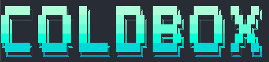

<p align="center">
	
</p>

<p align="center">
	<a href="https://github.com/coldbox/coldbox-cli/actions/workflows/snapshot.yml"></a>
	<a href="https://forgebox.io/view/coldbox-cli"></a>
	<a href="https://forgebox.io/view/coldbox-cli"></a>
	<a href="https://forgebox.io/view/coldbox-cli"></a>
</p>

<p align="center">
	Copyright Since 2005 ColdBox Platform by Luis Majano and Ortus Solutions, Corp
	<br>
	<a href="https://www.coldbox.org">coldbox.org</a> »
	<a href="https://www.boxlang.io">boxlang.io</a> »
	<a href="https://www.ortussolutions.com">ortussolutions.com</a>
</p>

# ColdBox CLI



This is the official ColdBox CLI for CommandBox.  It is a collection of commands to help you work with ColdBox and its ecosystem for building, testing, and deploying BoxLang and CFML applications.  It provides commands for scaffolding applications, creating tests, modules, models, views, and much more.

## Table of Contents

- [Table of Contents](#table-of-contents)
- [License](#license)
- [ColdBox CLI Versions](#coldbox-cli-versions)
- [Installation](#installation)
- [Usage](#usage)
 	- [📱 Application Creation](#-application-creation)
  		- [🧙‍♂️ Interactive App Wizard](#️-interactive-app-wizard)
 	- [Application Templates](#application-templates)
  		- [🥊 BoxLang Templates (Recommended)](#-boxlang-templates-recommended)
  		- [📜 Legacy CFML Templates](#-legacy-cfml-templates)
  		- [🚀 Template Features](#-template-features)
  		- [⚡ Vite Integration](#-vite-integration)
  		- [🐳 Docker Integration](#-docker-integration)
 	- [🎯 Handlers (Controllers)](#-handlers-controllers)
 	- [📊 Models \& Services](#-models--services)
 	- [🎨 Views \& Layouts](#-views--layouts)
 	- [🔧 Resources \& CRUD](#-resources--crud)
 	- [📦 Modules](#-modules)
 	- [🧪 Testing](#-testing)
 	- [🗄️ ORM \& Database](#️-orm--database)
 	- [🔗 Interceptors](#-interceptors)
 	- [🔄 Development Workflow](#-development-workflow)
 	- [🎛️ Global Options](#️-global-options)
  		- [Application-Specific Flags](#application-specific-flags)
  		- [Language Generation Control](#language-generation-control)
 	- [💡 BoxLang Support](#-boxlang-support)
  		- [🔍 Automatic Detection](#-automatic-detection)
  		- [⚙️ Configuration Examples](#️-configuration-examples)
   			- [Method 1: Language Property (Recommended)](#method-1-language-property-recommended)
   			- [Method 2: TestBox Runner Setting](#method-2-testbox-runner-setting)
  		- [🚀 Usage Examples](#-usage-examples)
  		- [📝 Generated Code Differences](#-generated-code-differences)
 	- [🤖 AI Integration](#-ai-integration)
  		- [Setup \& Management](#setup--management)
  		- [AI Agents](#ai-agents)
  		- [Guidelines](#guidelines)
  		- [Skills](#skills)
  		- [MCP Servers](#mcp-servers)
  		- [AI Context Management](#ai-context-management)
 	- [📖 Getting Help](#-getting-help)
- [Credits \& Contributions](#credits--contributions)
 	- [The Daily Bread](#the-daily-bread)

## License

Apache License, Version 2.0.

## ColdBox CLI Versions

The CLI matches the major version of ColdBox. **Current version: 8**

- If you are using **ColdBox 8**, use CLI `@8` (recommended)
- If you are using **ColdBox 7**, use CLI `@7.8.0` (recommended)

This versioning ensures you get the correct commands and features for your version of ColdBox.

## Installation

Install the commands via CommandBox like so:

```bash
box install coldbox-cli
```

## Usage

The ColdBox CLI provides powerful scaffolding and development tools for both **CFML** and **BoxLang** applications. All commands support the `--help` flag for detailed information.

### 📱 Application Creation

Create new ColdBox applications from various templates. **BoxLang is now the default language** for new applications:

```bash
# Create a basic ColdBox app (BoxLang by default)
coldbox create app myApp
coldbox create app myApp --boxlang   # Force BoxLang (default)

# Create a CFML app explicitly
coldbox create app myApp --cfml

# Create with specific templates
coldbox create app myApp skeleton=modern
coldbox create app myApp skeleton=rest
coldbox create app myApp skeleton=flat

# Create with additional features
coldbox create app myApp --migrations     # Database migrations support
coldbox create app myApp --docker         # Docker environment setup
coldbox create app myApp --vite          # Vite frontend asset building
coldbox create app myApp --rest          # REST API configuration

# Combine multiple features
coldbox create app myApp --migrations --docker --vite

# Interactive app wizard (recommended for beginners)
coldbox create app-wizard
```

#### 🧙‍♂️ Interactive App Wizard

The `app-wizard` command provides an interactive, step-by-step process for creating new applications. It's perfect for beginners or when you want to explore all available options:

```bash
coldbox create app-wizard
```

The wizard will guide you through:

1. **Project Location**: Whether to create in current directory or a new folder
2. **Language Selection**: Choose between BoxLang (default) or CFML
3. **Project Type**: API/REST service or full web application
4. **Frontend Setup**: Optional Vite integration for web applications
5. **Environment**: Optional Docker containerization
6. **Database**: Optional migrations support

**Example Wizard Flow**:

```
Are you currently inside the "myapp" folder? [y/n]: n
Is this a BoxLang project? [y/n]: y
Are you creating an API? [y/n]: n
Would you like to configure Vite as your Front End UI pipeline? [y/n]: y
Would you like to setup a Docker environment? [y/n]: y
Are you going to require Database Migrations? [y/n]: y
```

### Application Templates

The CLI supports multiple application templates (skeletons), or you can use your own via any FORGEBOX ID, GitHub repo, local path, zip or URL. **BoxLang templates are now the primary focus** for modern development:

#### 🥊 BoxLang Templates (Recommended)

- `boxlang` (default) - A modern ColdBox app using BoxLang as the primary language with latest features
- `modern` - A modern ColdBox app supporting both BoxLang and CFML with contemporary architecture
- `rest` - A ColdBox REST API template optimized for BoxLang development

#### 📜 Legacy CFML Templates

- `flat` - A classic ColdBox app with a flat structure for traditional CFML development
- `rest-hmvc` - A RESTful ColdBox app using HMVC architecture
- `supersimple` - A bare-bones template for minimal setups
- `vite` - A ColdBox app integrated with Vite for frontend development (legacy)

#### 🚀 Template Features

Modern templates (`boxlang`, `modern`) support additional features via flags:

- `--vite` - Integrates Vite for modern frontend asset building and hot reloading
- `--rest` - Configures the application as a REST API service
- `--docker` - Includes Docker configuration for containerized development
- `--migrations` - Sets up database migrations support

#### ⚡ Vite Integration

The CLI now supports Vite integration for modern frontend development with hot module replacement and optimized builds:

```bash
# Create app with Vite support
coldbox create app myApp --vite

# Available for BoxLang and Modern templates
coldbox create app myApp skeleton=modern --vite
```

**Vite Features Included**:

- Pre-configured `vite.config.mjs` with ColdBox/BoxLang integration
- Hot module replacement (HMR) for development
- Optimized production builds with code splitting
- Asset preprocessing for CSS, SCSS, JavaScript, and TypeScript
- Development server with proxy configuration
- Build scripts in `package.json`

**Development Workflow**:

```bash
# Start development server with hot reloading
npm run dev

# Build for production
npm run build

# Preview production build
npm run preview
```

#### 🐳 Docker Integration

The CLI provides Docker integration to containerize your ColdBox applications for consistent development and deployment environments:

```bash
# Create app with Docker support
coldbox create app myApp --docker

# Combine with other features
coldbox create app myApp --docker --vite --migrations
```

**Docker Features Included**:

- Multi-stage `Dockerfile` optimized for ColdBox applications
- `docker-compose.yml` for local development with services
- Database service configuration (PostgreSQL/MySQL)
- Redis caching service setup
- Environment variable configuration
- Production-ready container optimization
- Health checks and monitoring setup

**Docker Commands**:

```bash
# Build and start development environment
docker-compose up -d

# View logs
docker-compose logs -f

# Stop services
docker-compose down

# Rebuild containers
docker-compose up --build
```

### 🎯 Handlers (Controllers)

Generate MVC handlers with actions and optional views:

```bash
# Basic handler
coldbox create handler myHandler

# Handler with specific actions
coldbox create handler users index,show,edit,delete

# REST handler
coldbox create handler api/users --rest

# Resourceful handler (full CRUD)
coldbox create handler photos --resource

# Generate with views and tests
coldbox create handler users --views --integrationTests
```

### 📊 Models & Services

Create domain models and business services:

```bash
# Basic model
coldbox create model User

# Model with properties and accessors
coldbox create model User properties=fname,lname,email --accessors

# Model with migration
coldbox create model User --migration

# Model with service
coldbox create model User --service

# Model with everything (service, handler, migration, seeder)
coldbox create model User --all

# Standalone service
coldbox create service UserService
```

### 🎨 Views & Layouts

Generate view templates and layouts:

```bash
# Create a view
coldbox create view users/index

# View with helper file
coldbox create view users/show --helper

# View with content
coldbox create view welcome content="<h1>Welcome!</h1>"

# Create layout
coldbox create layout main

# Layout with content
coldbox create layout admin content="<cfoutput>#view()#</cfoutput>"
```

### 🔧 Resources & CRUD

Generate complete resourceful components:

```bash
# Single resource (handler, model, views, routes)
coldbox create resource photos

# Multiple resources
coldbox create resource photos,users,categories

# Custom handler name
coldbox create resource photos PhotoGallery

# With specific features
coldbox create resource users --tests --migration
```

### 📦 Modules

Create reusable ColdBox modules:

```bash
# Create module
coldbox create module myModule

# Module with specific features
coldbox create module myModule --models --handlers --views
```

### 🧪 Testing

Generate various types of tests:

```bash
# Unit tests
coldbox create unit models.UserTest

# BDD specs
coldbox create bdd UserServiceTest

# Integration tests
coldbox create integration-test handlers.UsersTest

# Model tests
coldbox create model-test User

# Interceptor tests
coldbox create interceptor-test Security --actions=preProcess,postProcess
```

### 🗄️ ORM & Database

Work with ORM entities and database operations:

```bash
# ORM Entity
coldbox create orm-entity User table=users

# ORM Service
coldbox create orm-service UserService entity=User

# Virtual Entity Service
coldbox create orm-virtual-service UserService

# ORM Event Handler
coldbox create orm-event-handler

# CRUD operations
coldbox create orm-crud User
```

### 🔗 Interceptors

Create AOP interceptors:

```bash
# Basic interceptor
coldbox create interceptor Security

# Interceptor with specific interception points
coldbox create interceptor Logger points=preProcess,postProcess

# With tests
coldbox create interceptor Security --tests
```

### 🔄 Development Workflow

Manage your development environment:

```bash
# Reinitialize ColdBox framework
coldbox reinit

# Auto-reinit on file changes
coldbox watch-reinit

# Open documentation
coldbox docs
coldbox docs search="event handlers"

# Open API documentation
coldbox apidocs
```

### 🎛️ Global Options

Most commands support these common options:

- `--force` - Overwrite existing files without prompting
- `--open` - Open generated files in your default editor
- `--boxlang` - Force BoxLang code generation (usually not needed as it's the default)
- `--cfml` - Force CFML code generation (overrides BoxLang default)
- `--help` - Show detailed help for any command

#### Application-Specific Flags

For application creation commands:

- `--migrations` - Include database migrations support
- `--docker` - Include Docker configuration and containerization
- `--vite` - Include Vite frontend asset building (modern/BoxLang templates)
- `--rest` - Configure as REST API application (BoxLang templates)

#### Language Generation Control

The CLI supports both automatic detection and manual override of the target language. **BoxLang is now the default language** for all new applications and generated code:

- **Default**: BoxLang code generation for new applications and components
- **Automatic**: Uses detection methods (server engine, `box.json` settings) for existing projects
- **Force CFML**: Use `--cfml` flag to generate CFML code regardless of detection
- **Force BoxLang**: Use `--boxlang` flag to explicitly generate BoxLang code (usually not needed as it's the default)

### 💡 BoxLang Support

The CLI automatically detects BoxLang projects and generates appropriate code. You can also force BoxLang mode using the `--boxlang` flag.

#### 🔍 Automatic Detection

The CLI detects BoxLang projects using three methods (in order of precedence):

1. **Server Engine Detection**: Running on a BoxLang server
2. **TestBox Runner Setting**: When `testbox.runner` is set to `"boxlang"` in `box.json`
3. **Language Property**: When `language` is set to `"boxlang"` in `box.json`

#### ⚙️ Configuration Examples

##### Method 1: Language Property (Recommended)

```json
{
    "name": "My BoxLang App",
    "language": "boxlang",
    "testbox": {
        "runner": "/tests/runner.bxm"
    }
}
```

##### Method 2: TestBox Runner Setting

```json
{
    "name": "My App",
    "testbox": {
        "runner": "boxlang"
    }
}
```

### 🗂️ App Layout Detection

The CLI automatically detects whether your project uses a **modern** or **flat** layout and generates files in the correct location.

| Layout | Detection | App Code Location | Tests Location |
| ------ | --------- | ----------------- | -------------- |
| **Modern** | Both `app/` and `public/` directories exist | `/app/models`, `/app/handlers`, etc. | `/tests/` |
| **Flat** | Default (no `app/` + `public/`) | `/models`, `/handlers`, etc. | `/tests/` |

#### Modern Layout (e.g. `boxlang`, `modern` templates)

```text
/app             - Application source code
  /config        - Configuration
  /handlers      - Event handlers
  /models        - Models & services
  /views         - View templates
  /layouts       - Layout wrappers
  /interceptors  - Interceptors
/public          - Web root
/modules         - ColdBox modules
/tests           - Test suites
/resources       - Migrations, seeders, etc.
```

#### Flat Layout (e.g. `flat`, legacy templates)

```text
/config          - Configuration
/handlers        - Event handlers
/models          - Models & services
/views           - View templates
/layouts         - Layout wrappers
/interceptors    - Interceptors
/modules         - ColdBox modules
/tests           - Test suites
```

When you run a generation command in a modern-layout project, the CLI automatically targets the correct directory:

```bash
# In a flat layout project → creates /handlers/users.cfc
# In a modern layout project → creates /app/handlers/users.cfc
coldbox create handler users

# In a flat layout project → creates /models/User.cfc
# In a modern layout project → creates /app/models/User.cfc
coldbox create model User
```

You can always override the target directory explicitly:

```bash
coldbox create model User directory=app/models
```

#### 🚀 Usage Examples

```bash
# Default behavior (creates BoxLang code)
coldbox create handler users
coldbox create model User

# Explicit BoxLang generation (usually not needed)
coldbox create handler users --boxlang

# Force CFML generation for legacy projects
coldbox create handler users --cfml
coldbox create app myApp --cfml
```

#### 📝 Generated Code Differences

When BoxLang mode is detected or forced:

- Uses `.bx` file extensions instead of `.cfc`
- Generates `class` syntax instead of `component`
- Uses BoxLang-specific template variants
- Creates BoxLang test files (`.bxm` extensions)

### 🤖 AI Integration

The ColdBox CLI provides a comprehensive AI integration system that enhances your development workflow with intelligent coding assistance. This includes guidelines, skills, agent configurations, and MCP (Model Context Protocol) servers.

#### Setup & Management

```bash
# Install AI integration
coldbox ai install                    # Interactive setup
coldbox ai install agent=claude    # Setup with specific agent

# View current configuration
coldbox ai info                       # Show configuration summary
coldbox ai tree                       # Visual hierarchy of AI components
coldbox ai stats                      # Context usage and statistics
coldbox ai stats --verbose            # Detailed breakdown with model utilization

# Sync with installed modules
coldbox ai refresh                    # Update guidelines and skills

# Diagnose issues
coldbox ai doctor                     # Check AI integration health
```

#### AI Directory Structure

After `coldbox ai install`, your project will have a `.agents/` directory containing:

```
/.agents/
├── guidelines/         # AI framework and domain documentation
│   ├── core/          # ColdBox & BoxLang/CFML language guidelines (framework built-ins)
│   ├── custom/        # Your project-specific guidelines
│   └── overrides/     # Custom versions of core/module guidelines
├── skills/            # Implementation cookbooks for specific features
│   ├── {skill-name}/
│   │   └── SKILL.md   # Step-by-step implementation guide
│   └── overrides/     # Override core/module skills
└── manifest.json     # AI integration metadata (generated)
```

- **Guidelines**: Framework documentation and best practices (ColdBox, BoxLang, CFML, etc.)
- **Skills**: Specialized coding cookbooks for implementing specific features
- **Manifest**: Tracks installed guidelines, skills, agents, and MCP servers

#### Setup & Management

```bash

Configure AI assistants for your project (Claude, GitHub Copilot, Cursor, etc.):

```bash
# Manage agents
coldbox ai agents list                # List available agents
coldbox ai agents add claude copilot  # Add multiple agents
coldbox ai agents remove cursor       # Remove an agent
coldbox ai agents refresh             # Regenerate all configurations
```

**Supported Agents**: Claude (CLAUDE.md → AGENTS.md), GitHub Copilot (.github/copilot-instructions.md), Cursor (.cursorrules), Codex (AGENTS.md), Gemini (GEMINI.md), OpenCode (AGENTS.md)

#### Guidelines

Framework documentation and best practices for AI assistants:

```bash
# View guidelines
coldbox ai guidelines list            # List all installed guidelines
coldbox ai guidelines list --verbose  # Show details and descriptions

# Manage guidelines
coldbox ai guidelines add coldbox testbox        # Install by name
coldbox ai guidelines add https://example.com/   # Install from URL
coldbox ai guidelines remove testbox              # Remove guideline
coldbox ai guidelines refresh                        # Update from modules
```

**Guideline Types**: Core (framework), Module (from installed modules), Custom (project-specific), Override (custom versions of core)

#### Skills

AI coding cookbooks with practical how-to examples:

```bash
# View skills
coldbox ai skills list                # List all installed skills
coldbox ai skills list --verbose      # Show details

# Manage skills
coldbox ai skills add creating-handlers async-programming
coldbox ai skills remove async-programming
coldbox ai skills refresh             # Update from modules
```

**Skill Categories**: Scaffolding, Testing, Configuration, Database, REST APIs, Security, Performance, and more

#### MCP Servers

Model Context Protocol documentation servers provide live, up-to-date documentation access for AI agents. ColdBox CLI manages three types of MCP servers and keeps them in sync in both the manifest and the root `.mcp.json` file (compatible with VS Code, Claude Desktop, and other MCP clients):

```bash
# View MCP configuration
coldbox ai mcp list                  # List all configured servers
coldbox ai mcp list --verbose        # Show descriptions and URLs

# Install cbMCP (live ColdBox app introspection)
coldbox ai mcp install               # Install cbmcp module + register at http://localhost:8888/cbmcp
coldbox ai mcp install --port=8080   # Custom port
coldbox ai mcp install --force       # Overwrite existing cbmcp config

# Add/remove custom servers
coldbox ai mcp add company-docs --url=https://docs.company.com/mcp
coldbox ai mcp remove company-docs
coldbox ai mcp remove cbsecurity --force   # Force remove a module server
```

**MCP Server Types**:

- **Core** (auto-configured): coldbox, boxlang, testbox, wirebox, cachebox, logbox, commandbox
- **Module** (auto-detected from `box.json`): cbsecurity, quick, cfmigrations, cbvalidation, cbwire, and 20+ more
- **Custom**: Any URL-based or stdio MCP server you add manually
- **cbMCP** (local app): Your running ColdBox application exposed as an MCP server via `coldbox ai mcp install`

**What cbMCP provides**: Once installed and your server is running, AI agents can query your live application for current routes, handler actions, model interfaces, and more — enabling context-aware code generation tailored to your actual project structure.

#### AI Context Management

**Subagent Pattern**: ColdBox CLI uses an optimized architecture that keeps agent files lean while providing full capability on-demand:

- **Core Guidelines Referenced** (~0 tokens in agent file): ColdBox framework + language guidelines stored in `.agents/guidelines/core/` and loaded on-demand via `read_file` when needed
- **Resource Inventories** (~13KB): Module guidelines and skills listed with descriptions for on-demand loading
- **Total Base Context**: ~250 lines per agent file (down from ~1,000 lines when guidelines were inlined)

The CLI tracks and analyzes your AI context usage:

- **Context Estimation**: Calculates total KB and token usage
- **Usage Indicators**: Shows Low/Moderate/High/Very High warnings
- **Model Compatibility**: Displays utilization for Claude, GPT-4, GPT-3.5-Turbo, Gemini
- **Optimization Tips**: Monitors context efficiency with the subagent pattern

```bash
coldbox ai stats                      # Quick overview
coldbox ai stats --verbose            # Full analysis with model breakdowns
coldbox ai stats --json               # Machine-readable output
```

### 📖 Getting Help

Every command provides detailed help:

```bash
# General help
coldbox help

# AI integration help
coldbox ai help

# Specific command help
coldbox create handler --help
coldbox ai agents --help
coldbox ai stats --help
```

## Credits & Contributions

I THANK GOD FOR HIS WISDOM IN THIS PROJECT

### The Daily Bread

"I am the way, and the truth, and the life; no one comes to the Father, but by me (JESUS)" Jn 14:1-12
